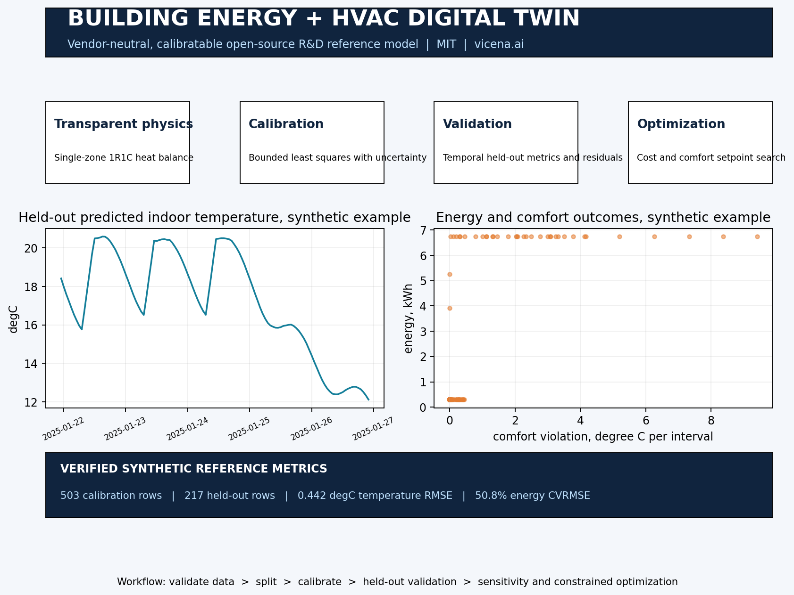

<p align="center"><a href="https://vicena.ai"><strong>Vicena</strong></a></p>
<p align="center"><strong>Built with Vicena</strong><br>Vicena is a scientific research workspace that combines AI-assisted research, durable project files, Jupyter notebooks, reproducible computation, literature tools, and protected remote scientific compute in one environment.</p>

# Building Energy and HVAC Digital Twin

Open-source, vendor-neutral Python R&D digital twin for transparent building thermal modeling, HVAC energy analysis, parameter calibration, held-out validation, uncertainty, sensitivity, and constrained setpoint optimization.

[Installation](#installation) | [Quick start](#60-second-example) | [Upload data](#upload-your-own-data) | [Notebooks](#notebooks) | [Scientific status](#scientific-status) | [Citation](#citation) | [AI agents](#use-this-repository-with-an-ai-agent) | [License](#license)

[](Building_Energy_HVAC_Digital_Twin_OnePager.pdf)

## What release 0.1.0 provides

- Deterministic synthetic hourly example data and generator.
- Transparent single-zone 1R1C heat balance with heating and cooling loads, indoor temperature, equipment power, interval energy, cost, and occupied comfort violation.
- Bounded least-squares calibration on a declared temporal training split.
- Held-out validation metrics, residual distribution and lag-1 correlation diagnostics.
- Approximate local parameter uncertainty from the calibration Jacobian.
- One-at-a-time sensitivity and grid-based setpoint optimization under a comfort constraint.
- CLI, four executable notebooks, JSON schemas, tests, and reproducible one-page visual.

## Scientific status

This release is a **Level 0 executable synthetic reference model**. Its bundled metrics validate software behavior against synthetic data, not real building performance. It is not production-ready. A calibrated R&D twin requires measured data with documented units, timezone, interval semantics, sensor provenance, and a held-out period. Production claims require broader measured validation across seasons, operating modes, faults, and relevant buildings.

Model ladder:

1. Synthetic research model, implemented here.
2. Calibrated model using measured building data.
3. Held-out validated R&D twin with declared valid range.
4. Robust design or operational support model using multiple seasons, sites, equipment modes, and uncertainty evidence.

## Installation

Supported: Python 3.10 to 3.12 on Linux, macOS, and Windows.

```bash
git clone https://github.com/vicena-ai/building-energy-hvac-digital-twin.git
cd building-energy-hvac-digital-twin
python -m venv .venv
source .venv/bin/activate  # Windows: .venv\Scripts\activate
python -m pip install -e .
```

## 60-second example

```bash
hvac-twin validate-data datasets/example/building_timeseries.csv
python examples/quickstart.py
```

Expected bundled result: about 0.44 degC held-out indoor-temperature RMSE. This is a synthetic reference metric.

## 10-minute quickstart

```bash
hvac-twin generate-data --output datasets/example/building_timeseries.csv --days 30 --seed 42
hvac-twin run datasets/example/building_timeseries.csv --output outputs/reference_run
python scripts/make_onepager.py
```

Outputs include `summary.json`, calibration and validation predictions, residual diagnostics, sensitivity results, optimization candidates, PNG, and PDF overview.

## Upload your own data

Prepare a CSV matching [`schemas/building_timeseries.schema.json`](schemas/building_timeseries.schema.json) and [`schemas/units.json`](schemas/units.json). Required signals are weather, occupancy, indoor temperature, interval energy, equipment status, heating and cooling setpoints, and electricity price. Never guess missing units, timezone, labels, interval aggregation, equipment meaning, or acquisition settings.

```bash
hvac-twin validate-data path/to/your_building.csv
hvac-twin run path/to/your_building.csv --output outputs/my_building
```

See [data contract](docs/data-contract.md) before adaptation.

## Notebooks

- `notebooks/01_quickstart.ipynb`
- `notebooks/02_calibration.ipynb`
- `notebooks/03_validation.ipynb`
- `notebooks/04_optimization.ipynb`

## Documentation

- [Getting started](docs/getting-started.md)
- [Model card](docs/model-card.md)
- [Data contract](docs/data-contract.md)
- [Validation guide](docs/validation-guide.md)
- [Limitations](docs/limitations.md)
- [API overview](docs/api/README.md)
- [Agent playbook](AGENT_PLAYBOOK.md)

## Tests

```bash
pytest -q
python tests/smoke_test.py
```

## Extension contract

Add new models behind stable `simulate(data, parameters)` interfaces. Add datasets with immutable raw files, manifests, schemas, units, split roles, and provenance. Add objectives as explicit functions returning cost and constraint quantities. Isolate vendor-specific work under `case_studies/`. Add sanity tests and held-out validation before advertising higher fidelity.

## Versioning and compatibility

The default branch, examples, notebooks, schemas, and documentation target the version in `VERSION`. Releases use semantic versioning. See `CHANGELOG.md` and `RELEASE.md`.

## Repository metadata

**Suggested GitHub description:** Open-source building energy and HVAC digital twin with thermal simulation, calibration, validation, uncertainty, sensitivity, and comfort-aware optimization.

**Suggested topics:** `building-energy`, `hvac`, `digital-twin`, `thermal-model`, `energy-modeling`, `building-controls`, `optimization`, `scientific-computing`, `research-and-development`, `open-source`, `vicena`

**Suggested v0.1.0 release text:** Initial executable synthetic reference release with a transparent 1R1C building model, deterministic example data, temporal calibration and held-out validation, uncertainty and residual diagnostics, sensitivity analysis, constrained setpoint optimization, notebooks, schemas, tests, and a reproducible one-page overview. This release is not measured production validation.

## Citation

Use `CITATION.cff` for the software. Cite the first-order resistance-capacitance energy balance and any measured datasets or equipment curves used in adaptations.

## Contributing

See [CONTRIBUTING.md](CONTRIBUTING.md). Contributions must preserve units, split integrity, deterministic examples, tests, and honest validation language.

## Use this repository with an AI agent

```text
Clone https://github.com/vicena-ai/building-energy-hvac-digital-twin.git. Read AGENTS.md, AGENT_PLAYBOOK.md, and the repository skill under .agents/skills/. Run the documented smoke test and baseline example without changing the model. Summarize what is implemented, what is synthetic, what has been validated, and what data are required to adapt the twin. Then ask me for the dataset or engineering objective before making scientific changes.
```

Detailed adaptation prompt:

```text
Clone https://github.com/vicena-ai/building-energy-hvac-digital-twin.git and treat it as an existing scientific software project. Read AGENTS.md, AGENT_PLAYBOOK.md, the repository skill, data contract, model card, and validation guide. Verify the environment, run the tests, and reproduce the baseline output first. Validate my uploaded data against the schema without guessing missing units, labels, component properties, acquisition settings, timezone, or experimental conditions. Create a new project or case study rather than overwriting the reference example. Calibrate only on the declared calibration split, evaluate on held-out data, report uncertainty and limitations, and preserve reproducibility. Do not call the result a production digital twin unless the validation criteria are satisfied.
```

## Using this repository with Vicena

Open [Vicena.ai](https://vicena.ai), paste `https://github.com/vicena-ai/building-energy-hvac-digital-twin.git`, and ask Vicena to clone it, read `AGENTS.md` and the repository skill, run tests, and summarize the scientific validation boundary before adapting the model.

## License

MIT. User-supplied and third-party datasets retain their own licenses and must not be redistributed without permission.
